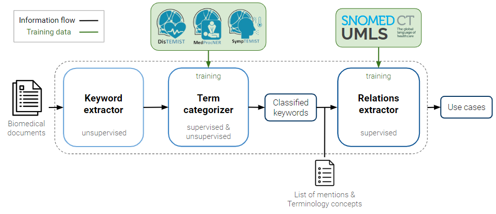
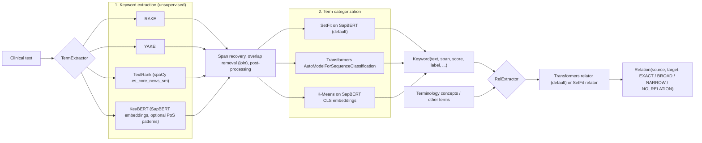
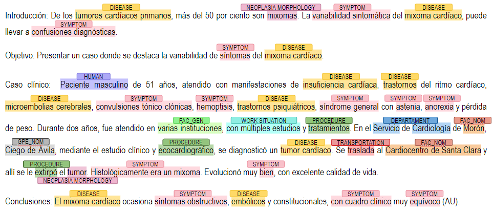

# KeyCARE 

**A pip-installable Python library that pulls keywords out of Spanish clinical text, sorts them into semantic categories, and classifies the hierarchical relations between terms. It works without annotated NER data.**

[](https://pypi.org/project/keycare/)
[](pyproject.toml)
[](LICENSE)

- **Upstream (official) repository:** [nlp4bia-bsc/KeyCARE](https://github.com/nlp4bia-bsc/KeyCARE)
- **PyPI package:** [`keycare`](https://pypi.org/project/keycare/)
- **Built at:** [Barcelona Supercomputing Center](https://www.bsc.es/), NLP for Biomedical Information Analysis group (NLP4BIA)
- **Thesis:** *KeyCARE: a framework for biomedical Keyword Extraction, term Categorization, and semantic Relation*, Biomedical Engineering Final Degree Project, Sergi Marsol Torrent, June 2024 (directors: Luis Gascó, Martin Krallinger)

This is my personal copy of the library, with its full commit history.

---

## Overview

Hospitals produce huge amounts of unstructured clinical text: discharge summaries, case reports, radiology notes. The standard way to get structured information out of it is supervised Named Entity Recognition (NER). NER needs manually annotated corpora for every entity type and language, and those are expensive to build and often don't exist. The problem is worse in low-resource languages such as Catalan. Clinical terminologies like SNOMED CT also have to be enriched and kept up to date by hand.

KeyCARE takes another route. It gives you one interface for three steps:

1. **Keyword extraction (unsupervised).** Four algorithms find candidate terms with character spans: [RAKE](https://pypi.org/project/rake-nltk/), [YAKE!](https://github.com/LIAAD/yake), [TextRank](https://pypi.org/project/pytextrank/) and [KeyBERT](https://github.com/MaartenGr/KeyBERT).
2. **Term categorization (few-shot, supervised or unsupervised).** Terms are assigned to semantic classes such as `ENFERMEDAD` (disease), `SINTOMA` (symptom), `PROCEDIMIENTO` (procedure), drugs, neoplasm morphology, species and locations. You can use a [SetFit](https://github.com/huggingface/setfit) classifier, a fine-tuned Transformers sequence classifier, or K-Means clustering over embeddings.
3. **Semantic relation classification (supervised).** A pair of terms is labeled `EXACT`, `BROAD`, `NARROW` or `NO_RELATION`. This links extracted terms to each other and to terminology concepts.

Every model sits on top of a Spanish biomedical **SapBERT** encoder (`BSC-NLP4BIA/SapBERT-from-roberta-base-biomedical-clinical-es` and its "parents" variant). The fine-tuned classifiers are published on the Hugging Face Hub under `BSC-NLP4BIA/`.

<p align="center"></p>
<p align="center"><em>KeyCARE pipeline. The categorizer is trained on BSC NER gold-standard corpora (DisTEMIST, MedProcNER, SympTEMIST, ...); the relations extractor is trained on term pairs mined from SNOMED CT / UMLS. Figure from the thesis.</em></p>

## What I built

I was the **lead developer** of KeyCARE. I designed and implemented the library during a 7-month internship at BSC NLP4BIA (July 2023 to January 2024), and it became my Biomedical Engineering bachelor's thesis. Luis Gascó supervised the project and co-authored part of the code.

- **Authorship:** I wrote 97 of the 105 commits on the upstream `nlp4bia-bsc/KeyCARE` main branch (`git log nlp4bia/main --format='%an' | sort | uniq -c`; the author names *sergimarsol*, *Sergi Marsol* and *Sergi Marsol Torrent* are all me).
- **Library architecture:** I built the object-oriented package layout: an `Extractor` base class with four extractor backends, a `Categorizer` base with three backends, a `Relator` base with two backends, the shared `Keyword` and `Relation` data structures, and the two public entry points `TermExtractor` and `RelExtractor`.
- **Extraction post-processing:** span recovery, overlap removal across extractors (`join=True`), and removal of stopwords, non-alphanumeric and "meaningless" terms. When `top_n` is not given, the default budget is one keyword per 10 words.
- **Training data and models:** I built a 98,484-term classification corpus from BSC NER gold standards and generated more than 10 million source/target/relation triplets from the SNOMED CT hierarchy, including "close" and "distant" `NO_RELATION` negatives. I then trained and evaluated the SetFit and Transformers term classifiers and relation classifiers that the library downloads by default.
- **Training and evaluation API:** `train_classifier` (precision, recall and F1, a classification report, and a multilabel confusion-matrix heatmap) and `train_clustering`.
- **Packaging and docs:** the PyPI release (`keycare`, 19 versions from 0.0.1 to 0.1.0) and the two tutorial notebooks in `nbs/`.
- **Use cases:** unsupervised generation of NER candidates (including a first test on Catalan records), term-prevalence and co-occurrence analysis over about 249k Mesinesp papers, and a semi-automatic relation-validation workflow for terminology enrichment.

## How it works



| Component | Options (`src/keycare/...`) | Default model |
|---|---|---|
| Extractors | `rake`, `yake`, `textrank`, `keybert` (`extractors/`) | KeyBERT uses `BSC-NLP4BIA/SapBERT-parents-from-roberta-base-biomedical-clinical-es` |
| Categorizers | `setfit`, `transformers`, `clustering` (`categorizers/`) | `BSC-NLP4BIA/biomedical-term-classifier-setfit` / `BSC-NLP4BIA/biomedical-term-classifier` |
| Relators | `transformers`, `setfit` (`relators/`) | `BSC-NLP4BIA/biomedical-semantic-relation-classifier` / `...-setfit` |

Example output of the extraction and categorization pipeline on a Spanish cardiology case report from the Mesinesp corpus:

<p align="center"></p>

## Results

All numbers below come from the thesis (*Marsol Torrent, 2024*, Section 5.3 to 5.4) and were measured on BSC gold-standard corpora. "Relaxed" means any overlap with a gold entity counts as a match; "exact" requires identical boundaries.

**Term categorization:** SetFit on Spanish SapBERT, multilabel, 3 epochs. Trained on 73,863 terms and tested on 24,621 terms drawn from MedProcNER, DisTEMIST, SympTEMIST, DrugTEMIST, CanTEMIST, LivingNER, MeddoProf and MeddoPlace.

| Class | Precision | Recall | F1 |
|---|---|---|---|
| Disease | 0.83 | 0.82 | 0.83 |
| Procedure | 0.96 | 0.97 | 0.97 |
| Symptom | 0.91 | 0.88 | 0.90 |
| Neoplasm morphology | 0.92 | 0.96 | 0.94 |
| **Weighted avg (all classes)** | **0.93** | **0.93** | **0.93** |
| Macro avg (all classes) | 0.84 | 0.82 | 0.83 |

**Relation classification:** Transformers relator on SapBERT, trained on 1.5M SNOMED CT/UMLS triplets for 2 epochs.

| Test set | Macro F1 | Weighted F1 |
|---|---|---|
| 200k held-out triplets generated like the training data (balanced) | 0.93 | 0.93 |
| 5,000 manually annotated triplets (73% `NO_RELATION`, harder distribution) | 0.60 | 0.72 |

**End-to-end NER-candidate generation** (TermExtractor, no NER training data), scored on the PROCEDURE and DISEASE classes:

| Configuration | Corpus | Overlap | Precision | Recall | F1 |
|---|---|---|---|---|---|
| RAKE (≤5 tokens) + SetFit | DisTEMIST | relaxed | 64.3% | 66.8% | **65.6%** |
| RAKE (≤5 tokens) + SetFit | MedProcNER | relaxed | 50.3% | 76.0% | 60.5% |
| RAKE + TextRank + KeyBERT (≤3 tokens) + SetFit | MedProcNER | relaxed | 28.6% | **94.3%** | 43.9% |
| RAKE (≤5 tokens) + SetFit | DisTEMIST | exact | 30.2% | 31.4% | 30.7% |

These scores do not match supervised NER, and they are not meant to. What they show is high-recall candidate generation for settings where annotation is scarce: a human can then validate the candidates far faster than annotating from scratch. The weak spots are visible on the manually annotated relation set. Semantically close but unrelated pairs tend to be predicted as `BROAD`, `EXACT` or `NARROW`, and the thesis discusses this in detail.

## Getting started

### Installation

```sh
pip install keycare
python -m spacy download es_core_news_sm   # used by the TextRank and KeyBERT/PoS extractors
```

Development install from this repository (originally developed with Python 3.10.12; `pyproject.toml` requires Python 3.9 or newer):

```sh
git clone https://github.com/sergimarsol/KeyCARE.git
cd KeyCARE
python3 -m venv .env_keycare && source .env_keycare/bin/activate
pip install -r requirements.txt
pip install -e .
```

On first use the library downloads the NLTK `stopwords`/`punkt` data and the default models from the Hugging Face Hub (several hundred MB).

### TermExtractor: extract and categorize keywords

```python
from keycare.TermExtractor import TermExtractor

text = """Acude al Servicio de Urgencias por cefalea frontoparietal derecha.
Mediante biopsia se diagnostica adenocarcinoma de próstata Gleason 4+4=8 con metástasis óseas múltiples.
Se trata con Ácido Zoledrónico 4 mg iv/4 semanas."""

extractor = TermExtractor()            # defaults: extraction_methods=["textrank"], categorization_method="setfit"
extractor(text)                        # runs extraction + categorization; results stored on the object
for kw in extractor.keywords:          # list of Keyword objects
    print(kw.text, kw.span, kw.score, kw.extraction_method, kw.label)
```

Main constructor arguments (see `src/keycare/TermExtractor.py`):

| Argument | Default | Meaning |
|---|---|---|
| `extraction_methods` | `["textrank"]` | Any subset of `"rake"`, `"yake"`, `"textrank"`, `"keybert"` (always a list) |
| `categorization_method` | `"setfit"` | `"setfit"`, `"transformers"` or `"clustering"` |
| `max_tokens` | `3` | Maximum tokens per keyword |
| `top_n` | `None` | Keywords per extractor (default is about 1 per 10 words) |
| `join` | `False` | Merge results of several extractors and remove overlaps |
| `postprocess` | `True` | Clean stopwords, non-alphanumeric and meaningless terms |
| `pos`, `pos_pattern` | `False`, noun/adj/propn/verb pattern | Part-of-speech-pattern extraction (KeyBERT only) |
| `n`, `thr_setfit`, `thr_transformers` | `1`, `0.5`, `-1` | Max labels per keyword and score thresholds |
| `n_clusters` | `None` | Required when `categorization_method="clustering"` |
| `categorizer_model_path` | Spanish SapBERT | Base encoder for training or clustering |
| `classifier_model`, `clustering_model` | `None` | Load your own trained classifier or KMeans model |
| `output_path` | `"./trained_model"` | Where trained models are saved |

More examples, taken from `nbs/Tutorial_TermExtractor.ipynb`:

```python
# Several extractors, merged, 5 keywords each, no post-processing
extractor = TermExtractor(extraction_methods=["rake", "yake"], top_n=5, join=True, postprocess=False)

# KeyBERT restricted to noun + adjective PoS patterns
extractor = TermExtractor(extraction_methods=["keybert"], pos=True, pos_pattern="<NOUN.*>*<ADJ.*>*", top_n=3)

# Multilabel output: up to 3 labels with SetFit probability > 0.05
extractor = TermExtractor(top_n=7, categorization_method="setfit", thr_setfit=0.05, n=3)

# Unsupervised categorization into 3 clusters
extractor = TermExtractor(categorization_method="clustering", top_n=7, n_clusters=3)
```

Training a categorizer on your own labeled terms (toy data included in `data/toy_data/`):

```python
import pandas as pd
train = pd.read_csv("data/toy_data/traindata.tsv", sep="\t")
test = pd.read_csv("data/toy_data/testdata.tsv", sep="\t")

extractor = TermExtractor(categorization_method="setfit", output_path="./trained_setfit_model")
extractor.train_classifier(train["text"].tolist(), train["label"].tolist(),
                           test["text"].tolist(), test["label"].tolist(),
                           mcm=True, classification_report=True)

# Or fit the clustering categorizer on a list of mentions
extractor = TermExtractor(categorization_method="clustering", n_clusters=3)
extractor.train_clustering(train["text"].tolist())
```

### RelExtractor: classify relations between terms

```python
from keycare.RelExtractor import RelExtractor

source = ["cáncer", "enfermedad de pulmón", "mastectomía radical izquierda", "laparoscopia"]
target = ["cáncer de mama", "enfermedad pulmonar", "mastectomía", "Streptococus pneumoniae"]

relextractor = RelExtractor()          # defaults: relation_method="transformers", n=1, thr_transformers=-1
relextractor(source, target)           # pairwise; source and target must have equal length
for rel in relextractor.relations:     # list of Relation objects
    print(rel.source.text, "->", rel.target.text, rel.rel_type)
# e.g. cáncer -> cáncer de mama ['BROAD'];  enfermedad de pulmón -> enfermedad pulmonar ['EXACT']
```

- `RelExtractor(relation_method="setfit", n=2, thr_setfit=0.05)`: SetFit relator with up to 2 labels per pair.
- `RelExtractor(all_combinations=True)`: score every source × target pair.
- `RelExtractor(model_path="...")`: load your own trained relation model.
- `source` and `target` can each be a string, a `Keyword`, or a list of either, so `TermExtractor.keywords` can be passed in directly.

Full walkthroughs are in [`nbs/Tutorial_TermExtractor.ipynb`](nbs/Tutorial_TermExtractor.ipynb) and [`nbs/Tutorial_RelExtractor.ipynb`](nbs/Tutorial_RelExtractor.ipynb). Spanish video tutorials: [TermExtractor](https://youtu.be/xLLCjsbuV_U) and [RelExtractor](https://youtu.be/-kJJJSnYCCI).

## Tech stack

Python · PyTorch · Hugging Face Transformers · SetFit · sentence-transformers · KeyBERT · spaCy · NLTK (RAKE) · YAKE · pytextrank · scikit-learn · pandas · setuptools/PyPI

## Repository structure

```
src/keycare/
├── TermExtractor.py          # public API: extraction + categorization pipeline
├── RelExtractor.py           # public API: relation classification
├── extractors/               # Extractor base + Rake/Yake/TextRank/KeyBert extractors
├── categorizers/             # Categorizer base + SetFitClassifier, TransformersClassifier, Clustering
├── relators/                 # Relator base + TransformersRelator, SetFitRelator
├── utils/data_structures.py  # Keyword and Relation classes
└── tests/termextractor_pipeline.py  # batch-run script over a folder of .txt files
nbs/                          # tutorial notebooks
data/toy_data/                # small labeled term set for training demos
data/text_files/              # sample Spanish clinical case texts
figures/                      # pipeline and example figures (from the thesis)
www/                          # logos
KeyCARE_grouppresentation.pdf # slides presented to the BSC NLP4BIA group
pyproject.toml, requirements.txt
```

## Acknowledgements

KeyCARE was developed at the **Barcelona Supercomputing Center, NLP4BIA group**, under the supervision of **Dr. Luis Gascó** (supervisor and code contributor) and **Dr. Martin Krallinger**, as part of the TeresIA terminology project. Training and evaluation data come from the NLP4BIA/PlanTL gold-standard corpora (DisTEMIST, MedProcNER, SympTEMIST, DrugTEMIST, CanTEMIST, LivingNER, MeddoProf, MeddoPlace), plus SNOMED CT and UMLS. Base encoders are the NLP4BIA Spanish SapBERT models. The official repository is [nlp4bia-bsc/KeyCARE](https://github.com/nlp4bia-bsc/KeyCARE). If you use KeyCARE, please cite that repository.

## License

MIT License © 2023 nlp4bia-bsc. See [LICENSE](LICENSE).
